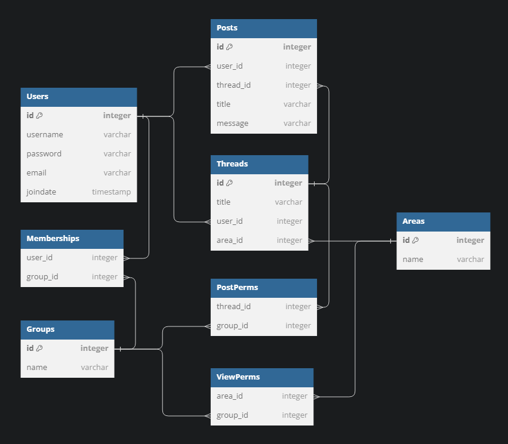

Table Users {
    id integer [primary key]
    username varchar
    password varchar
    email varchar
    joindate timestamp
}

Table Messages {
    id integer [primary key]
    user_id integer
    thread_id integer
    title varchar
    message varchar
}

Table Threads {
    id integer [primary key]
    title varchar
    user_id integer
    area_id integer
}

Table Areas {
    id integer [primary key]
    name varchar
    visibility integer
}

Table Groups {
    id integer [primary key]
    name varchar
}

Table Memberships {
    user_id integer
    group_id integer
}

Table ViewPerms {
    area_id integer
    group_id integer
}

Table PostPerms {
    thread_id integer
    group_id integer
}

Ref: Messages.user_id > Users.id
Ref: Messages.thread_id > Threads.id

Ref: Threads.user_id > Users.id
Ref: Threads.area_id > Areas.id

Ref: Memberships.user_id > Users.id
Ref: Memberships.group_id > Groups.id 

Ref: ViewPerms.area_id > Areas.id
Ref: ViewPerms.group_id > Groups.id

Ref: PostPerms.thread_id > Threads.id
Ref: PostPerms.group_id > Groups.id

Hint: use 'code' view for proper formatting.

### Visualization

